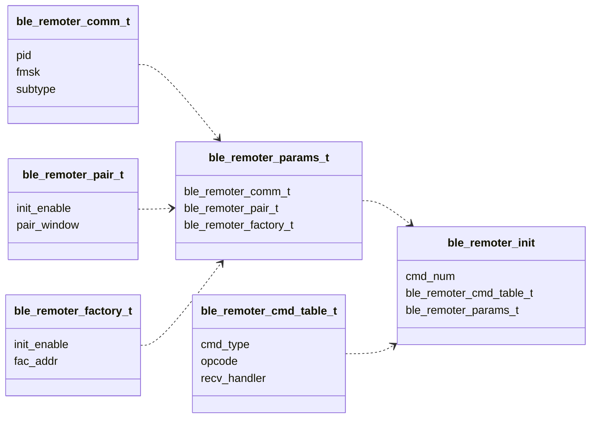

# 概要

`ble_remoter` 是支持小匠蓝牙广播协议规范V3.0的组件，目前支持以下功能:
* 支持多遥控器控制
* 支持FAC工厂万能遥控器控制能力

# 架构预览

软件架构如下：

# MenuConfig
* `support multi control` : 支持多遥控器控制
* `use big endian pid` : 使用大端模式的PID(后续废弃)
* `not use scan unit (ms * 8 / 5)` : 内部启用扫描单元转换，兼容以前内部不自行转换的芯片
* `scan interval (ms)` : 扫描间隔，单位ms
* `scan window (ms)` : 扫描窗口，单位ms
* `filter max num` : 最大过滤器数量
* `cmd table max num` : 最大支持的cmd table 数量

# 结构体介绍: 
* ``ble_remoter_comm_t`` 通用项初始化结构体：
	主要提供 `pid` 、`fmsk`和 `subtype` 产品来配置设备蓝牙遥控器产品信息

* `ble_remoter_pair_t` 配对模式初始化结构体：
	`enable`: 初始化自动使能配对功能
	`pair_window`: 配置配对窗口

* `ble_remoter_factory_t` 工厂模式初始化结构体：
	`enable`: 初始化自动使能工厂功能，可理解为万能遥控器控制
	`fac_addr`: 工厂模式的特殊mac地址，不能与正常使用的mac地址一样

* `ble_remoter_cmd_table_t` 对遥控器的键值控制进行抽象：
	`cmd_type`: 命令类型：控制命令，配对命令，工厂命令
	`opcode`: 遥控器操作码
	`recv_handler`: 接收回调

# 使用方法
1. 配置qm_config

2. 配置cmd table，可参考[ble_remoter_example.c]
   	```c
	static ble_remoter_cmd_table_t g_cmd_table[] = {
		{BLE_REMOTE_CMD_TYPE_PAIR, 0x01, pair_recv},
		{BLE_REMOTE_CMD_TYPE_COMM, 0x02, comm1_recv},
		{BLE_REMOTE_CMD_TYPE_COMM, 0x10, comm2_recv},    
	};
   	```
 
3. 初始化组件
   	```c
    ble_remoter_params_t params = {

        .comm_param = {
            .fmsk = 0,
            .pid = 0,
            .subtype = 1,
        },
        
        .pair_param = {
            .enable = QM_TRUE,
            .pair_window = 10 * 1000,
        },

    };
    return ble_remoter_init(&params, g_cmd_table, QM_ARRAY_SIZE(g_cmd_table));
   	```


4. 当设备接收到遥控器相关键值并满足条件时，则触发用户注册的handler  
   	```c
	static void pair_recv(ble_remoter_cmd_type_t cmd_type, uint8_t opcode, ble_remoter_payload_t *payload)
	{
		QM_LOGD("1", "pair_recv !!");
	}

	static void comm1_recv(ble_remoter_cmd_type_t cmd_type, uint8_t opcode, ble_remoter_payload_t *payload)
	{
		QM_LOGD("1", "comm1_recv @@");
	}

	static void comm2_recv(ble_remoter_cmd_type_t cmd_type, uint8_t opcode, ble_remoter_payload_t *payload)
	{
		QM_LOGD("1", "comm2_recv ##");
	}
   	```